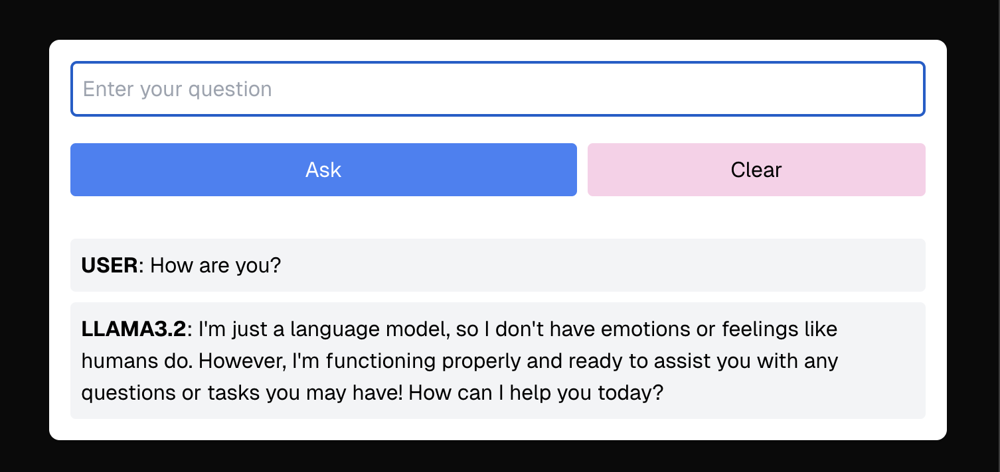
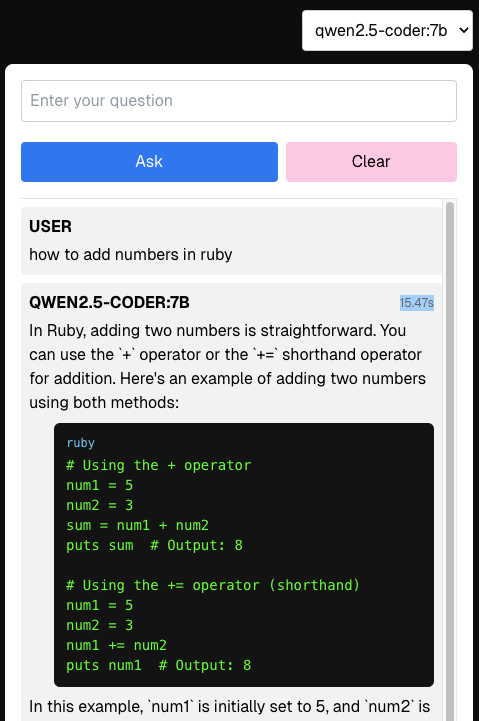

# ollama-next

### Talk to it with a chat model

  

### Ask it code questions with a code model

  

### Install

- Install the ollama cli
  - at 'https://ollama.com/download'
- Get the llama3.2 model
  - `ollama pull llama3.2:latest`
- Get the qwen2.5-coder:7b model
  - `ollama pull qwen2.5-coder:7b`
- Run the ollama model server
  - `ollama serve`
- Run the ollama-next model ui
  - `pnpm install`
  - `pnpm run dev`

### Other useful commands

- `ollama ps`
- `ollama run llama3.2`
- `ollama stop llama3.2`

### How it works

- You install and run the ollama server
- You pull the running model which the code desires
  - See src/server/trpc/router.ts where the model is ran and queried
  - There is a line which tells the server which model to use
- The ui is an interface to chat with the model
- It "remembers" the last 7 or so things you asked about to simulate memory
